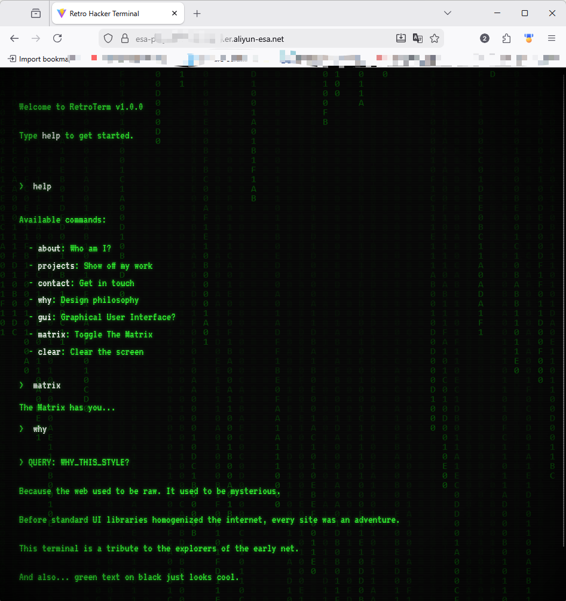

# 阿里云 ESA 复古极客终端 (Retro Terminal) 🚀

_ESA 边缘计算创新大赛参赛作品 | 复古赛博朋克风格个人主页_

## 项目概览 (Project Overview)

本项目是**阿里云 ESA (Edge Security Acceleration) 边缘计算创新大赛**的创意参赛作品。我们重构了传统的个人作品集网站，将其打造为一个沉浸式的、基于命令行的交互体验，致敬 90 年代和千禧年初的黑客极客文化。

借助 **阿里云 ESA** 强大的边缘计算能力，我们将这个富交互的静态网站分发到全球节点，确保用户在世界任何角落都能体验到闪电般的加载速度。

## 🔥 核心亮点：与 AI 深度对话

> **不仅仅是复古，更是智能。**

本项目内置了**通义千问 (Qwen-Turbo)** 的原生支持。在终端中输入命令，即可建立与 AI 的即时通讯链路。

*   🤖 **AI 智能链路**: 输入 `tongyi` 命令，终端将瞬间化身为你的私人 AI 助手。
*   🔐 **安全交互**: 支持输入个人的 DashScope API Key（仅在会话内存中安全存储），即刻开启无限对话可能。
*   💬 **沉浸体验**: 所有的 AI 回复都以复古的打字机特效呈现，仿佛来自矩阵深处的信号。

## 设计哲学："数字怀旧" (Digital Nostalgia)

在如今 UI 设计追求极致扁平与极简的时代，**Retro Terminal** 旨在找回早期互联网那种充满*探索感*与*神秘感*的体验。

*   **"活着"的机器**: 这不仅仅是一个网页，更是一个模拟器。扫描线、屏幕曲率、荧光辉光……这些细节完美复刻了老式 CRT 显示器的物理瑕疵，让数字体验变得触手可及且带有温度。
*   **交互即探索**: 拒绝被动浏览，用户必须通过键盘输入指令来与系统“交谈”。这种类似游戏的互动方式，让每一次回车都充满仪式感。
*   **性能与美学的平衡**: 基于 **Vite + React** 构建并部署于 **阿里云 ESA**，我们证明了高强度的视觉风格化（Canvas 动画、CSS 特效）完全可以与其背后的现代高性能基础设施完美共存。

## 功能特性 (Key Features)

*   📺 **CRT 拟真**: 像素级还原扫描线、暗角晕影和屏幕闪烁动态。
*   ⌨️ **全功能终端**: 支持命令历史回顾 (Up/Down 键)、自动补全感和打字机音效视觉化。
*   🤖 **通义 AI 对话**: 深度集成 Qwen-Turbo 模型，在复古界面中体验最前沿的 AI 智能。
*   🌧️ **黑客帝国模式**: 输入 `matrix` 或 `矩阵Matrix`，唤醒经典的数字雨 Canvas 特效。
*   ⚡ **ESA 边缘加速**: 针对单页应用 (SPA) 路由优化的全球边缘分发。

## 如何探索 (How to Explore)

在终端中输入 `help` 查看所有可用命令。
(你可以尝试输入 `about`, `projects`, 或者直接输入 `tongyi` 开始与 AI 聊天!)

---

### ⚠️ 部署故障排除 (Troubleshooting)

如果你在部署时遇到错误：`code version number exceeds the quota limit`，这意味着你的阿里云 ESA 项目版本数量已达上限。

**解决方案:**
1. 登录 [阿里云 ESA 控制台](https://esa.console.aliyun.com/)。
2. 进入你的项目 -> **版本管理 (Versions)** (或边缘程序 Edge Routines)。
3. 删除旧的、不再使用的版本以释放配额。
4. 重新提交部署。

---

### 声明
“本项目由阿里云ESA提供加速、计算和保护”
